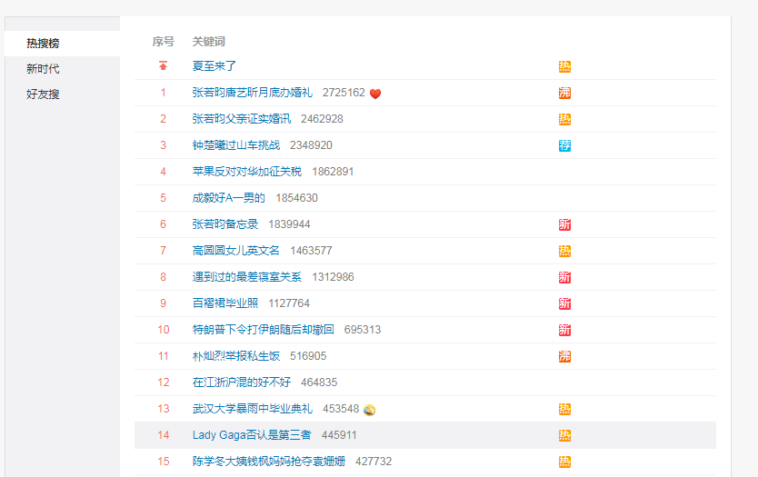

# 微博热搜榜中网民的群体形象分析（暂定）

## 一、问题的提出

新浪微博是我国主要的社交平台，根据微博2019年第一季度财报，微博月活跃用户数已达到4.65亿。微博热搜榜，作为微博上重要的新闻展示方式之一，具有实时更新、简要明了、交互性强的特点。热搜榜每分钟更新一次，根据搜索热度进行排序，向用户提供实时热点。这些热点根据可信用户短时间内的搜索数量，以及搜索量的变化趋势计算而来，如果用户对某一关键词的搜索量越大，点击量越多，那么该关键词在热搜榜的位置就越靠前，在热搜榜停留的时间也就越长。因此，作为微博的主要版块之一，热搜榜不仅是热点话题的展示板，同时也是反映网民关注点和兴趣点的一面镜子。

近年来，学界对于微博热搜榜的研究呈上升趋势。以“微博热搜”为关键词在知网进行搜索，我们可以发现， 从2015年1月到2019年5月，以“微博热搜”为主题的论文共发表24篇。发表年份主要集中在2017-2018年间，特别是2018年，共有13篇相关论文发表。具体来看，研究者主要从以下三个角度对微博热搜榜进行研究：

（一）探讨微博热搜榜存在的合理性。首先是方便用户了解时下热点事件，发表个人观点，满足情感宣泄的需求，例如《传播学视域下微博热搜榜的问题研究》（杨宁）一文中写道，“微博热门话题直观地反映了在特定时间段内众多微博用户关注的焦点，一定程度上可以帮助用户在信息碎片化的微博媒介里快速地筛选出当下最新最热的话题”。其次是有利于缩小社会阶层的差距，微博网民之间的交流更加平等，如《传播学视野下微博热搜榜存在合理性分析》（张艺瀚）一文中谈到，“经济收入水平高或者经济收入水平相对较低的人，都能参与到自己感兴趣的微博热搜事件并且积极参与事件的话题讨论，原有的经济地位决定话语权的局面被打破”。第三是合理利用微博形成舆论热点，推进办案进程，成为司法的监督者。

（二）探讨微博热搜榜存在的问题。首先是泛娱乐化严重，议题设置不合理，整个热搜榜围绕明星设置议题，社会事件等严肃议题鲜有人关心，例如《微博泛娱乐化倾向的影响及对策》（汪侠静）一文中写道，“微博热搜主体明星化显著；以“娱乐”、“情感”、“星座”为热搜关键词，民生政治新闻被淡化”。其次是监管缺失，虚假信息泛滥，不少自媒体为了吸引用户，夸大事实，甚至凭空捏造。第三是用户话语权不均衡，论战频发，经常一言不合便对别人施加网络暴力，例如《传播学视角下微博热搜榜存在问题浅析》（刘洋）一文中谈到，“观念和立场的限制，会导致论战的爆发，甚至由网络空间追溯到现实社会，通过“人肉搜索”等方式，对别人施加网络暴力”。

（三）传统媒体对微博热搜榜的利用。首先是传统媒体通过热搜榜及时了解网民的兴趣点和关注点，通过整合相关内容，为读者提供更加贴近民生的新闻。其次是传统媒体通过热搜榜分析事件情况，有利于把握舆情热度, 控制舆情蔓延。如《大数据背景下微博热搜的新闻阅读服务功能》（毛贺祺）一文中写道，“传统媒体可以合理通过微博评论的平台及时了解读者对于某一新闻发表出的观点，及时掌握偏激、不正确的观点，了解舆情的发展动态，分析下一步新闻报道的方向，及时对于不正常的舆情进行纠正”。

总体来看，以“微博热搜榜”为主要研究对象的论文数量较多，研究角度各异，大多数研究者将热搜榜作为一个整体进行分析，从热搜榜的特点、存在的问题、传统媒体对微博热搜榜的利用等方面进行了研究，强调了热搜榜对受众的影响。但微博作为一个交互性强的社交媒体平台，用户的关注点和兴趣点势必会影响热搜榜的内容和排名。某一类话题可以登上热搜榜，得到大众的普遍关注和讨论，其中必然隐含着大众的某种关注重点和价值取向。特别是在除去社会热点和娱乐新闻的喧嚣之外，大众如何看待自己，看待他人，看待周围的环境，并由此折射出怎样的价值观，从而构建了怎样的群体形象，值得我们探究。针对这一问题，学界目前尚未有深入的分析和研究，本文希望通过对微博热搜榜的分析，探究当代微博网民的价值观和群体形象。

## 二、研究方法

微博热搜榜由序号、关键词、搜索量和热搜等级四部分组成。共50个关键词，每个关键词旁边会标出实时搜索量以及热搜等级，热搜等级主要有“荐”、“新”、“热”、“沸”、“爆”等几种。

点进某个关键词，就会进入该关键词的话题页。话题页中包括置顶微博、话题主持人、话题贡献者排行、关于等多个版块。在“关于”版块中，可以看到，每一个关键词对应一个分类标签。分类标签既包括明星、综艺、电影、搞笑等娱乐类标签，也包括社会、财经、政务、互联网等时事类标签。

为了分析热搜榜所体现出的网民价值观和群体形象，我们从微博上爬取了2019年4月29日00:00 - 6月29日24:00的热搜榜，每隔5分钟爬取一次，共爬取无重复热搜XX条。然后选择其中分类标签为“情感”的关键词，共计XX条。

之所以选择分类为“情感”类的关键词，主要有三个原因：一、该标签下是与个人生活相关的热搜关键词，主要关注个人生活中的小事和个体情感状态。从内容上讲，更有利于分析微博网民在个人生活相关问题上的关注点和兴趣点，并由此观察他们身上所呈现出的群体特点和价值取向。这是选择该标签下关键词的主要原因。二、相较于明星、电影、综艺、游戏、音乐等娱乐类标签，“情感”类关键词较少受到人为干预，真实性更强。众所周知，微博热搜榜并非完全根据网民实时搜索确定，其中很多话题都是通过购买或者水军刷榜的形式登上热搜的。三、相较于社会、财经、时政、互联网等时事类标签，“情感”类关键词较少受到突发事件影响，关注内容表现出更好的稳定性和长期性。

本文采用内容分析法，首先，将获取到的“情感”类热搜关键词进行分类，按照表1的标准，将关键词分为9类。其次，按照表2的标准，判断每个热搜关键词的感情倾向。最后将数据进行统计汇总。

| 序号 |   类目   |                   定义说明                   |
| :--: | :------: | :------------------------------------------: |
|  1   |   工作   |       与工作相关的，包括公司、同事等的       |
|  2   |   家庭   |         与父母、亲戚、兄弟姐妹相关的         |
|  3   |   交友   |           与朋友、熟人、网友相关的           |
|  4   |   恋爱   | 与谈恋爱相关的，包括男女朋友、分手、约会等的 |
|  5   |   学习   | 与学习相关的，包括学校、专业、考试、同学等的 |
|  6   |   婚姻   |            与结婚、婚后生活相关的            |
|  7   |   自身   |    不涉及他人的，与自己的状态、情感相关的    |
|  8   | 生活小事 |   未涉及到以上关系且与身边发生的小事相关的   |
|  9   | 社会热点 |          与近期发生的热点事件相关的          |

​                                                                    表1 分类标准

| 序号 | 类目 |                  定义说明                  |
| :--: | :--: | :----------------------------------------: |
|  1   | 消极 | 与尴尬、自卑、孤僻、逃避、难过等情感相关的 |
|  2   | 积极 |     与快乐、感恩、喜欢、爱等情感相关的     |
|  3   | 中立 |             没有明显感情倾向的             |

​                                                                   表2  感情倾向判断标准

## 三、微博热搜榜“情感”类关键词概况

经过对XX条“情感”类关键词的统计，得出如下结论：

### （一）

## 四、从“情感”类关键词看网民的群体形象

## 五、结论

